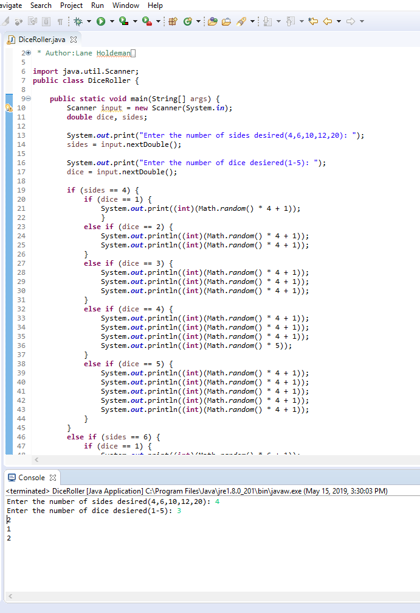

# DiceRoller
A user friendy and eassy way to roll dice.
We built this program for anyone who needs dice but doesn't have the time or money to get dice.
To run this program you need Code Runner or Eclipse or a program that allows you to run and edit java code.
The contributers were Kaede Cunningham (her github: KaedeLynn03) and my self.

```
import java.util.Scanner;
public class DiceRoller {

	public static void main(String[] args) {
		Scanner input = new Scanner(System.in);
		double dice, sides;
		
		System.out.print("Enter the number of sides desired(4,6,10,12,20): ");
		sides = input.nextDouble();
		
		System.out.print("Enter the number of dice desiered(1-5): ");
		dice = input.nextDouble();
		
		if (sides == 4) {
			if (dice == 1) {
				System.out.print((int)(Math.random() * 4 + 1));
				}
			else if (dice == 2) {
				System.out.println((int)(Math.random() * 4 + 1));
				System.out.println((int)(Math.random() * 4 + 1));
			}
			else if (dice == 3) {
				System.out.println((int)(Math.random() * 4 + 1));
				System.out.println((int)(Math.random() * 4 + 1));
				System.out.println((int)(Math.random() * 4 + 1));
			}
			else if (dice == 4) {
				System.out.println((int)(Math.random() * 4 + 1));
				System.out.println((int)(Math.random() * 4 + 1));
				System.out.println((int)(Math.random() * 4 + 1));
				System.out.println((int)(Math.random() * 5));
			}
			else if (dice == 5) {
				System.out.println((int)(Math.random() * 4 + 1));
				System.out.println((int)(Math.random() * 4 + 1));
				System.out.println((int)(Math.random() * 4 + 1));
				System.out.println((int)(Math.random() * 4 + 1));
				System.out.println((int)(Math.random() * 4 + 1));
			}
		}
		else if (sides == 6) {
			if (dice == 1) {
				System.out.print((int)(Math.random() * 6 + 1));
			}
			else if (dice == 2) {
				System.out.println((int)(Math.random() * 6 + 1));
				System.out.println((int)(Math.random() * 6 + 1));
			}
			else if (dice == 3) {
				System.out.println((int)(Math.random() * 6 + 1));
				System.out.println((int)(Math.random() * 6 + 1));
				System.out.println((int)(Math.random() * 6 + 1));
			}
			else if (dice == 4) {
				System.out.println((int)(Math.random() * 6 + 1));
				System.out.println((int)(Math.random() * 6 + 1));
				System.out.println((int)(Math.random() * 6 + 1));
				System.out.println((int)(Math.random() * 6 + 1));
			}
			else if (dice == 5) {
				System.out.println((int)(Math.random() * 6 + 1));
				System.out.println((int)(Math.random() * 6 + 1));
				System.out.println((int)(Math.random() * 6 + 1));
				System.out.println((int)(Math.random() * 6 + 1));
				System.out.println((int)(Math.random() * 6 + 1));
			}
		}
		    
		else if (sides == 10) {
		   if (dice == 1) {
			   System.out.print((int)(Math.random() * 10 + 1));
			}
		   else if (dice == 2) {
		            System.out.println((int)(Math.random() * 10 + 1));
		            System.out.println((int)(Math.random() * 10 + 1));
		        }
		        else if (dice == 3) {
		        	System.out.println((int)(Math.random() * 10 + 1));
		        	System.out.println((int)(Math.random() * 10 + 1));
		        	System.out.println((int)(Math.random() * 10 + 1));
		        }
		        else if (dice == 4) {
		        	System.out.println((int)(Math.random() * 10 + 1));
		        	System.out.println((int)(Math.random() * 10 + 1));
		        	System.out.println((int)(Math.random() * 10 + 1));
		        	System.out.println((int)(Math.random() * 10 + 1));
		        }
		        else if (dice == 5) {
		        	System.out.println((int)(Math.random() * 10 + 1));
		        	System.out.println((int)(Math.random() * 10 + 1));
		        	System.out.println((int)(Math.random() * 10 + 1));
		        	System.out.println((int)(Math.random() * 10 + 1));
		        	System.out.println((int)(Math.random() * 10 + 1));
		        }
		    }
		    
		    else if (sides == 12) {
		        if (dice == 1) {
		            System.out.print((int)(Math.random() * 12 + 1));
		        }
		        else if (dice == 2) {
		            System.out.println((int)(Math.random() * 12 + 1));
		            System.out.println((int)(Math.random() * 12 + 1));
		        }
		        else if (dice == 3) {
		        	System.out.println((int)(Math.random() * 12 + 1));
		        	System.out.println((int)(Math.random() * 12 + 1));
		        	System.out.println((int)(Math.random() * 12 + 1));
		        }
		        else if (dice == 4) {
		        	System.out.println((int)(Math.random() * 12 + 1));
		        	System.out.println((int)(Math.random() * 12 + 1));
		        	System.out.println((int)(Math.random() * 12 + 1));
		        	System.out.println((int)(Math.random() * 12 + 1));
		        }
		        else if (dice == 5) {
		        	System.out.println((int)(Math.random() * 12 + 1));
		        	System.out.println((int)(Math.random() * 12 + 1));
		        	System.out.println((int)(Math.random() * 12 + 1));
		        	System.out.println((int)(Math.random() * 12 + 1));
		        	System.out.println((int)(Math.random() * 12 + 1));
		        }
		    }
		    
		    else if (sides == 20) {
		        if (dice == 1) {
		            System.out.print((int)(Math.random() * 20 + 1));
		        }
		        else if (dice == 2) {
		            System.out.println((int)(Math.random() * 20 + 1));
		            System.out.println((int)(Math.random() * 20 + 1));
		        }
		        else if (dice == 3) {
		        	System.out.println((int)(Math.random() * 20 + 1));
		        	System.out.println((int)(Math.random() * 20 + 1));
		        	System.out.println((int)(Math.random() * 20 + 1));
		        }
		        else if (dice == 4) {
		        	System.out.println((int)(Math.random() * 20 + 1));
		        	System.out.println((int)(Math.random() * 20 + 1));
		        	System.out.println((int)(Math.random() * 20 + 1));
		        	System.out.println((int)(Math.random() * 20 + 1));
		        }
		        else if (dice == 5) {
		        	System.out.println((int)(Math.random() * 20 + 1));
		        	System.out.println((int)(Math.random() * 20 + 1));
		        	System.out.println((int)(Math.random() * 20 + 1));
		        	System.out.println((int)(Math.random() * 20 + 1));
		        	System.out.println((int)(Math.random() * 20 + 1));
		        }
		    }
		    
		    else {
		    	System.out.print("That is an incorrect number");
		    }

		    
	}

}
```
